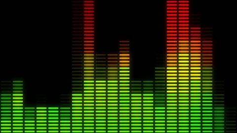

# Audio-Reactive Particles



## Overview

PopcornFX supports audio-reactive particle effects — particles that respond to sound in real time by sampling audio spectrum or waveform data. This is one of PopcornFX's showcase features, enabling effects like music-driven visualizers, bass-pulsing explosions, and beat-synchronized emissions.

In Warcraft 3 Reforged, **this feature is non-functional**. Audio samplers are present in the engine but return empty data, meaning any baked effect relying on `audio.spectrum()` or `audio.waveform()` will silently produce no visual response.

## How It Works (in Theory)

PopcornFX's audio sampling pipeline involves three components:

1. **`CParticleSamplerCPU_Spectrum`** — the CPU-side sampler that particle scripts reference. Created via `NewFromStatic`, it is initialized with a default audio descriptor and set to `ModeSpectrum`.

2. **`CParticleSamplerDescriptor_Audio_Default`** — the descriptor that performs the actual sampling. Its `Sample` method retrieves audio data by calling virtual methods on `IParticleScene`, the host application's scene interface.

3. **`IParticleScene`** — an interface that the host engine (Warcraft 3) must implement. It exposes two key virtual methods:
   - `GetAudioSpectrum(channelGroup, &outBaseCount)` — returns FFT spectrum data
   - `GetAudioWaveform(channelGroup, &outBaseCount)` — returns raw waveform data

During sampling, the descriptor checks the mode, calls the appropriate method on the scene, and if data is returned, interpolates it (point / linear / cubic filtering) to produce per-particle output values.

## Why It Doesn't Work

The `IParticleScene` base class provides default implementations for both audio methods:

```cpp
// Pseudocode reconstructed from disassembly
TMemoryView<float const*> IParticleScene::GetAudioSpectrum(CStringId channelGroup, uint* outBaseCount)
{
    *outBaseCount = 0;
    return TMemoryView<float const*>(nullptr, 0); // empty
}

TMemoryView<float const*> IParticleScene::GetAudioWaveform(CStringId channelGroup, uint* outBaseCount)
{
    *outBaseCount = 0;
    return TMemoryView<float const*>(nullptr, 0); // empty
}
```

Blizzard's scene class inherits from `IParticleScene` but **does not override** these methods. As a result:

- `GetAudioSpectrum` / `GetAudioWaveform` always return an empty memory view
- `Sample` detects the empty view and returns `false`
- The particle system receives no audio data — all spectrum/waveform reads evaluate to zero

The default descriptor also hardcodes the channel group name to `"Master"`, but this is irrelevant since the data retrieval never reaches a point where the channel name matters.

## Confirmation

This was confirmed through static analysis of the Warcraft 3 Reforged binary. The base `IParticleScene` default implementations are the only versions present — no overrides exist in the Blizzard-side code that would connect the game's audio engine (FMOD) to PopcornFX's sampling interface.

The same pattern applies to `GetDynamicStates`, another `IParticleScene` method where the default implementation simply clears all output states without providing real physics data.

## Impact

Any PopcornFX effect that uses audio attribute samplers will compile and load without errors but produce no audio-reactive behavior at runtime. The particles will render, but all audio-driven properties (scale, color, velocity, emission rate, etc.) will evaluate to zero or their default fallback values.